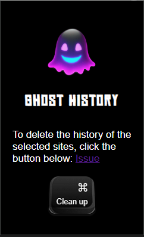

# Ghost History

<p align="center">
  
</p>

**Ghost History** is a Chrome extension designed to make it easy to delete browser history for selected websites.

## 📌 Features
- 👻 Quickly delete browser history for user-selected websites in seconds.
- 🖱️ Simple and intuitive interface: clean up with a single `Clean up` button.
- ⚙️ Runs seamlessly as a Chrome extension.

## 🛠️ Technologies
The following technologies were used to build this extension:
- 
- 
- 
- 

## 🚀 Installation
1. Clone this repository:
   ```bash
   git clone https://github.com/yourusername/ghost-history.git
   ```
2. Open Chrome and go to `chrome://extensions/`.
3. Enable Developer mode.
4. Click on Load unpacked and select the project folder.

---

### `USE SITE`: 📂 popup.js Documentation

The `popup.js` file contains the logic for clearing browser history of specific websites when the user clicks the "Clean up" button.

### Code Overview
The script listens for a click event on a button with the ID `clearHistory`. When clicked, it performs the following actions:
1. **Defines a list of websites to clear**: 
   ```javascript
   const sitesToClear = [
      "testsite.com",
      "testsite2.com", 
      "testsite3.com"
    ];
   ``` 
---

## 🖼️ Screenshot

Here’s how the extension looks:

<p align="center">  </p>

## 🧑‍💻 Development

### Project Structure

```paintext
css/ - Styling for the extension.
fonts/ - Fonts used in the interface.
icons/ - Icons for the extension.
background.js - Background script for managing history deletion.
manifest.json - Configuration file for the Chrome extension.
popup.html - HTML for the popup interface.
popup.js - JavaScript logic for the popup interface.
```

## 🤝 Contributing
Contributions are welcome! If you have suggestions or issues, please open an issue.

📜 License
This project is licensed under the MIT License.

<p align="center">Made with ❤️ by <strong>Jace Hayden(Jasur Haydarov)</strong></p> 